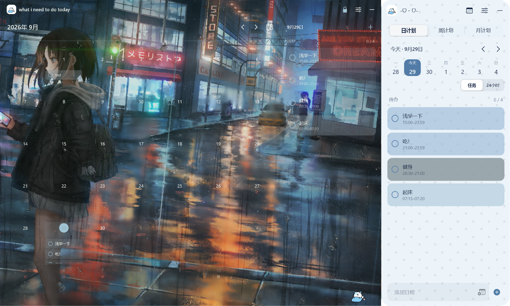

# 泥土豆 · NeedTODO

## 功能
- 日、周、月计划、日程提醒，桌面月历、日记。
- 自定义everything，名称、头像、图片、圆角和透明度都可自己设定，默认都是泥土豆。
- 支持 Windows 和 Android（日程横幅提醒、日程／月历桌面组件）。
- 外观修改仅保存在当前设备；未单独修改时沿用共享外观，日程与日记照常同步。
- 桌面悬浮球和系统托盘，可关闭窗口或退出软件。
- 在“设置 -> 账号”中可选择开机自启动，可分别选择开启清单、桌面月历，也可同时开启。
- 法定节假日及调休数据来自 [holiday-cn](https://github.com/NateScarlet/holiday-cn)，不推算尚未公布的假期。
- 首次启动可登录、注册或本机使用；绑定 GitHub 后可找回账号、跨设备同步。

## 预览

